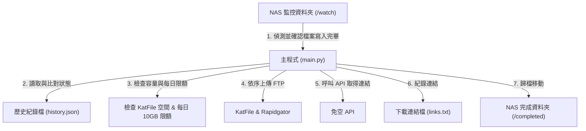

# NAS 免空自動上傳與收益系統 — 規劃文件

本文件詳細規劃了在 NAS 環境下運作的「免空自動上傳系統」的架構與任務分工。

---

## 0. 事前準備與規劃事項

在開始實作與部署系統前，請確保完成以下準備工作：

* [ ] **1. 平台帳號與憑證申請**
  * **KatFile 帳號**：需註冊帳戶，並於後台啟用 PPD 分潤模式，取得 FTP 上傳密碼與 [API 金鑰](https://katfile.com/?op=my_account)。
  * **Rapidgator 帳號**：需註冊帳戶，啟用分潤模式，取得 FTP 上傳密碼與 API 呼叫權限。
* [ ] **2. NAS 目錄結構建立**
  * 在 NAS 上建立專案根目錄：`/share/CACHEDEV1_DATA/Container/nas-auto-uploader`。
  * 在其下建立子目錄：
    * `watch` (暫存監控區)
    * `completed` (上傳完成歸檔區)
    * `config` (放置系統設定檔)
    * `data` (放置產出的連結紀錄檔)
* [ ] **3. NAS 權限設定**
  * 確保運行 Docker 的系統使用者對上述資料夾擁有完整的**讀取與寫入 (R/W) 權限**，避免容器內程式因權限不足無法移動檔案或寫入 `links.txt`。
* [ ] **4. 網路連線確認**
  * 確認 NAS 的防火牆與外部連線設定，允許對外連接 `ftp.katfile.com` 與 `upload.rapidgator.net` 的 FTP 傳輸埠 (Port 21)，以及 HTTPS 的 API 呼叫。

---

## 1. 系統架構設計 (簡化版)

## 1. 系統架構設計 (簡化版)

為了讓系統保持輕量、穩定且易於維護，我們捨棄複雜的資料庫與多執行緒佇列，改用**單一循環主腳本 (Single Loop Script)**，搭配一個輕量 JSON 狀態檔（`history.json`）來追蹤上傳進度：

這個簡化架構的優勢：
* **無資料庫依賴**：完全使用輕量 `history.json` 記錄每個檔案在上傳各平台的狀態（例如 KatFile: 成功, Rapidgator: 待上傳），避免資料庫毀損風險。
* **支援中斷續傳 (續傳非指 FTP 斷點，而是平台間的續傳)**：如果今天上傳 KatFile 達到每日 10GB 上限，Rapidgator 仍會繼續上傳；隔天額度恢復後，會自動補上傳 KatFile，完成後才將檔案移到完成區。
* **單執行緒循序處理**：檔案一個接著一個上傳，避免多檔案同時上傳榨乾 NAS 網路頻寬。

---

## 2. 任務切分與實作步驟

### 階段一：基礎環境建置與設定檔設計
* [ ] **1.1 初始化專案結構**：建立 `src/` 與 `config/` 目錄。
* [ ] **1.2 設計設定檔 (config.yaml)**：定義 API 金鑰 (如 KatFile API Key)、FTP 帳密、掃描間隔、KatFile 每日上傳限額 (預設 10GB)。
* [ ] **1.3 撰寫 Docker 部署檔**：`Dockerfile` 與 `docker-compose.yml`。

### 階段二：監控與歷史紀錄讀取 (main.py)
* [ ] **2.1 掃描資料夾**：讀取 `/watch` 下的檔案。
* [ ] **2.2 穩定度檢測**：比對檔案大小，確認沒有人在寫入後才開始處理。
* [ ] **2.3 讀取 `history.json`**：載入歷史上傳紀錄，判斷該檔案是否已在上傳佇列中，以及哪些平台已完成。

### 階段三：限制檢查、上傳、API 抓取與歸檔
* [ ] **3.1 空間與每日限額檢查**：
  * 呼叫 KatFile API 查詢剩餘空間。
  * 讀取今日已上傳總量，若加上目前檔案會超過 10GB，則暫停該檔案上傳至 KatFile，直到明日额度重置。
* [ ] **3.2 FTP 上傳**：依序將檔案上傳至尚未完成且空間與額度允許的平台（KatFile / Rapidgator）。
* [ ] **3.3 API 連結獲取**：呼叫免空 API（例如 `katfile.biz` API）抓取對應的下載連結。
* [ ] **3.4 紀錄與歸檔**：將連結寫入 `links.txt`，更新 `history.json`。若該檔案在所有啟用平台皆上傳成功，則將檔案移到 `/completed`。

---

## 3. 目錄掛載對照表

在 Docker Compose 啟動後，NAS 上的實體資料夾將與容器內的虛擬路徑進行對應：

| NAS 實體路徑 | 容器內對應路徑 | 說明 |
| :--- | :--- | :--- |
| `/share/CACHEDEV1_DATA/Container/nas-auto-uploader/watch` | `/watch` | 放置待上傳檔案的暫存監控區 |
| `/share/CACHEDEV1_DATA/Container/nas-auto-uploader/completed` | `/completed` | 上傳完成後，檔案自動歸檔至此 |
| `/share/CACHEDEV1_DATA/Container/nas-auto-uploader/config` | `/app/config` | 存放 `config.yaml` 系統設定檔 |
| `/share/CACHEDEV1_DATA/Container/nas-auto-uploader/data` | `/app/data` | 存放 `history.json` (狀態追蹤) 與 `links.txt` |
| `/share/CACHEDEV1_DATA/Container/nas-auto-uploader/src` | `/app/src` | 存放 Python 程式碼，修改時免 rebuild 容器 |

